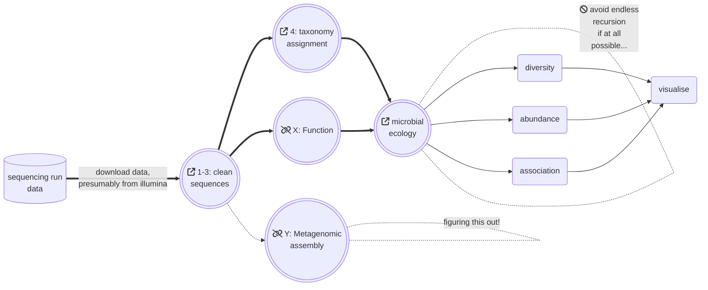

# `CLI`, `M`icro`b`ial `E`cology, and `R`

Some basic steps in microbial ecology, focusing on the processing of `2ndGen` Illumina `fastq` data, into either `amplicon` (e.g. 16S) or `metagenomic` (e.g. shotgun) datasets, followed by ecology-based analysis of the communities and patterns we find in that data.

### Metagenomic data (i.e. shotgun)

  * <a href="https://handibles.github.io/climber/documents/shotgun_assembly.html">`-->` Jump straight to the tutorial on metagenomic shotgun assembly </a> 

As above, the tutorial covers the following steps:

  0. Setting up your analysis - `bash` and friends
  1. Checking your sequence data - `FastQC` & `MultiQC`
  2. Sequencing QC - filtering and trimming your sequences - `Trimmomatic`
  3. Sequencing QC - purifying your sequences - `BowTie2`
  4. Metagenomic Community profiling - `Kraken2` & `Bracken`

We also move through <a href="documents/data_to_R.html">importing output from `Kaiju` or `Kraken2+Bracken` into `R`: </a>.

  * importing data into `R` - generating a count matrix, taxonomic table, and phyloseq object from metagenomic data

This metagenomic workflow is also present in simple, no-nonsense, `raw code` (note there might be differences to the complete workflow above).

  * <a href="documents/shotgun_assembly_raw.html">`raw code only of the metagenomic shotgun assembly`</a> - as above, less explanation

### Amplicon data (e.g. 16S)

Forthcoming. The initial steps (setup, get data, QC) are very similar in most cases (remember to cut off your primers!), but are followed by a denoising step (`DADA2`) and optionally an attempt to predict the metabolic capabilities of the communities at hand (`PICRUSt2`).

### Microbial Ecology (and `R`)

This is the real magic, and we get to make _pictures_. This part might be updated as annotated code ahead of actual tutorials - it's a massive collection of huge topics..

<a href="documents/mb6302__preamble.html">`see also here`</a>

---

This guide to metagenomic analysis continues to be updated (April, 3023). All (+/-)feedback is welcome: simply throw objects/comments directly at me, or [drop us a line at the related repo](https://github.com/handibles/climber/issues). <a href="documents/climber_todo.html">`</a>

all the best!  

<a href="https://www.fhi.ie/project/jamie-fitzgerald/"> `Jamie` </a>

 |  | 
