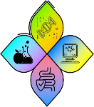

# `CLI`, `M`icro`b`ial `E`cology, and `R`

Some basic steps in microbial ecology, focusing on the processing of `2ndGen` Illumina `fastq` data, into either `amplicon` (e.g. 16S) or `metagenomic` (e.g. shotgun) datasets, followed by ecology-based analysis of the communities and patterns we find in that data.

## guides so far:

### Metagenomic data (i.e. shotgun)

  * <a href="documents/shotgun_assembly.html">metagenomic shotgun assembly - cheese and/or chicken data </a> 

Metagenomic shotgun assembly covers the following steps:

  0. <a href="/documents/shotgun_assembly.html#setup-your-environment">Setting up your analysis</a>
  1. <a href="/documents/shotgun_assembly.html#get-the-sequence-data-check.html">Checking your sequence data</a>
  2. <a href="/documents/shotgun_assembly.html#quality-control-check.html">Sequencing QC - filtering and trimming your sequences</a>
  3. <a href="/documents/shotgun_assembly.html#decontaminate-data-check">Sequencing QC - purifying your sequences - **not finished**</a>
  4. Kraken2 (unwritten)
  5. Bracken (unwritten)

A similar workflow is also present in simple, `raw code` (the two workflows will be unified once writing is finished).

  * <a href="documents/shotgun_assembly_raw.html">`raw code only of the metagenomic shotgun assembly`</a> - as above, but with less explanation 

### Amplicon data (e.g. 16S)

Not yet written. The initial steps (setup, get data, QC) are very similar in most cases (remember to cut off your primers!), but are followed by a denoising step (`DADA2`) and optionally an attempt to predict the metabolic capabilities of the communities at hand (`PICRUSt2`).

### Microbial Ecology (and `R`)

Not yet written. This is the real magic, and we get to make _pictures_.

---
  <a href="documents/climber_todo.html">`</a>

 |  | 
